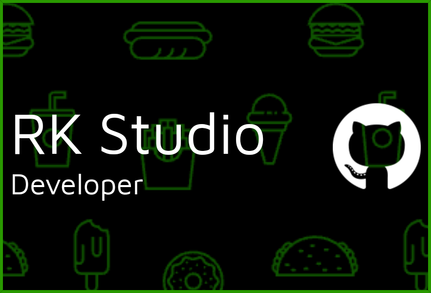

# Welcome to RK Studio 🌟
---

---
## 👋🏿 About Me
I'm **MD Riad Khan**, a passionate and driven software developer, ethical hacker, and cybersecurity enthusiast. With a strong foundation in programming and a keen interest in emerging technologies, I thrive on solving complex problems and building innovative solutions.

---
## 💪🏿 My Journey
My journey in tech began with a curiosity to understand how things work, which has evolved into a deep passion for coding and ethical hacking. I believe in continuous learning and adapting to new challenges, and I'm always exploring the latest trends and best practices in the tech world.

---

## 🚀 Tech Stack & Expertise
### 💻 Programming Languages:
- 
-  
- 
- 
- 
- 
- 
- 
- 
- 
- 
- 

---

### 🛠️ Frameworks & Libraries:
-  
- 
- 
- 
-  
- 
- 
- 
- 
- 
- 
- 
-  
- 
-  
- 
-  
-  
- 

---

### 🌱 Currently Learning:
- 
-  
-  
-  
-  
- 
-  
-  
-  
-  
- 
- 
- 
- 
- 

---

## 🌐 Connect with Me

I'm always open to connecting with like-minded professionals, collaborating on exciting projects, or simply discussing tech! Feel free to reach out to me via any of the platforms below:

- **🌍 Personal Website:** [RK Studio](https://rkstudio.com)
- **🐦 Twitter/X:** [@mrrkriad](https://x.com/mrrkriad)
- **📘 Facebook:** [MD Riad Khan](https://www.facebook.com/rkriad585)
- **📧 Gmail:** [RK Email](mailto:mdriyadkhan585@gmail.com)
- **📸 Instagram:** [@rk_studio585](https://www.instagram.com/rk_studio585)
- **🎥 YouTube:** [RK Studio](https://youtube.com/@rk_studio585)
- **💼 LinkedIn:** [MD Riad Khan](https://linkedin.com/in/md-riad-khan-764793284)
- **🧵 Threads:** [@mdriadkhan77](https://threads.net/@mdriadkhan77)
- **🐱 GitLab:** [MD Riad Khan RK](https://gitlab.com/mdriadkhanrk)
- **🎓 W3Schools Profile:** [RK Riad](w3profile.com/rk_riad585)
- **👨‍💻 Google Developer:** [RK Riad](https://g.dev/rkriaddev)
- **🗂️ StackOverflow:** [RK Riad](https://stackoverflow.com/users/22367594/rk-riad)
- **📬 Telegram:** [@RkRiad787](https://t.me/RkRiad787)

---

## 📊 GitHub Stats

---

## 🏆 GitHub Trophies

---

## 📚 Resources & Best Practices
While I currently don't maintain a blog, I highly recommend checking out these resources for best practices and insightful articles:

- 📝 [W3SCHOOL](https://www.w3schools.com/)
- 📖 [GitHub Guides](https://docs.github.com/en/rest/guides)
- 🔍 [OWASP Top Ten](https://owasp.org/www-project-top-ten/)
- 🌐 [Mozilla Developer Network (MDN)](https://developer.mozilla.org/)

---

### Thank You for Visiting!
Thank you for taking the time to check out my GitHub profile. I'm excited to share my work, collaborate with others, and continue learning and growing in this ever-evolving field.

**RK Studio** - Where Code Meets Creativity 🚀
